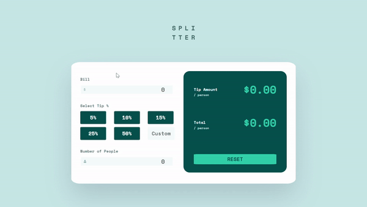

# **🖩 Tip Calculator App 🖩**

# **Welcome! 👋**

I decided to take on the challenge by Frontendmentor to create the **desktop version** of the [Tip Calculator App.](https://www.frontendmentor.io/challenges/tip-calculator-app-ugJNGbJUX)
\
\
To do this challenge, I used:
- **HTML**
- **Pure CSS**
- **Vanilla JavaScript**  
  
  
## **The Challenge**

- View the closest possible layout to the design given in the app (like the one above)
  
- See hover states for all interactive elements on the page
 
- Calculate the correct tip and total cost of the bill per person  
  

## **Setup**

- Download the git repo to your local device
  
- Open `index.html`
  
- Start playing with it! 😃